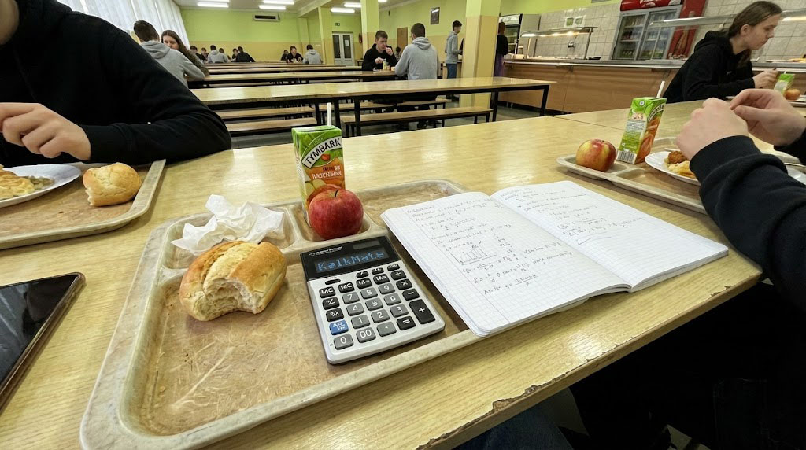
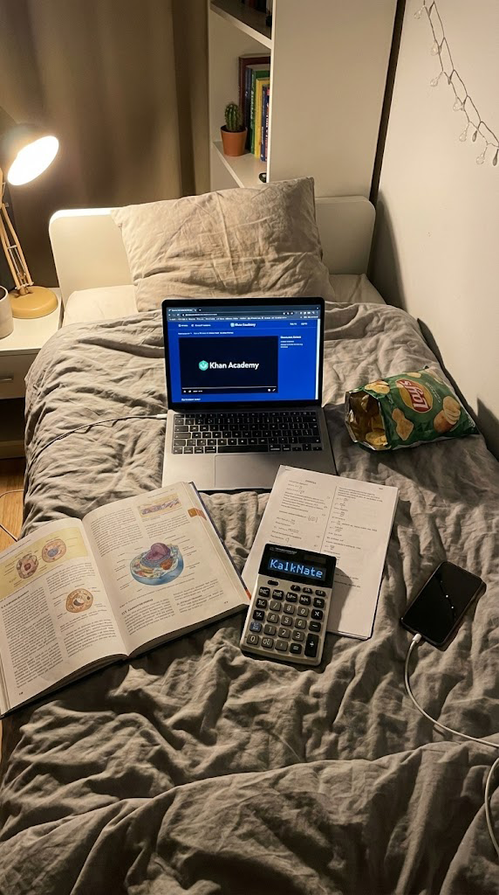
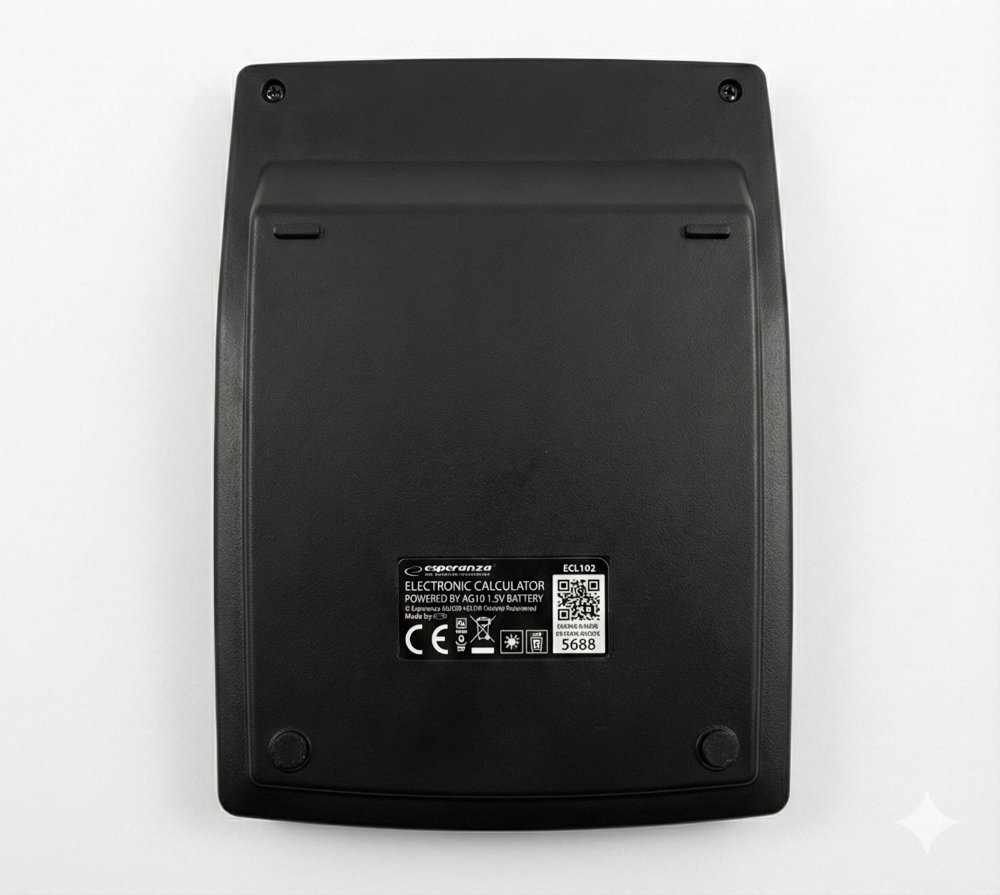
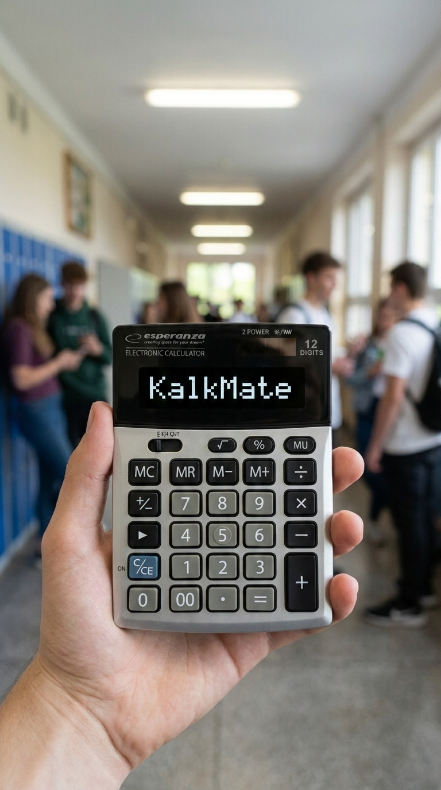

<p align="center">
  
</p>

<h1 align="center">KalkMate</h1>

<p align="center">
  🌐 <b>Language:</b> <a href="README.md">Polski</a> · English
</p>

<p align="center">
  <b>An AI-assisted calculator for Polish high-school exam prep.</b><br>
  Snap a photo of a problem — get a fully worked-out solution on screen, no phone, no distractions.
</p>

<p align="center">
  
</p>

> **Project status:** the first PCB (v4, ESP32-S3) has been soldered and is going through bring-up/debugging. Firmware, AI backend, and the online store are being developed in parallel. The prototype enclosure is an adapted off-the-shelf calculator case — a dedicated enclosure is being designed (see `docs/dol obudowy kalkulator.stl`).

---

## Table of contents

- [What is KalkMate](#what-is-kalkmate)
- [How it works](#how-it-works)
- [Gallery](#gallery)
- [Hardware](#hardware)
- [Firmware](#firmware-esp32-carduino)
- [Backend & website](#backend--website-website)
- [Production tools](#production-tools-tools)
- [Tech stack](#tech-stack)
- [Repository structure](#repository-structure)
- [Security](#security)
- [Project history](#project-history)
- [Roadmap](#roadmap)
- [FAQ](#faq)
- [License](#license)
- [Author](#author)

---

## What is KalkMate

A commercial educational product built for Polish high-school students preparing for their final exam ("matura") — a scientific calculator for at-home studying, with a compactly integrated camera (no protruding lens) and WiFi connectivity. When a student gets stuck on a homework problem, they photograph it and the device returns a full, explained solution within seconds — no phone, no browser, none of the notifications and distractions that come with using an AI app on a smartphone.

The goal is a cheap, convenient alternative to expensive private tutoring and scattershot searching for answers online — a self-study tool that helps a student **understand** a problem (full reasoning, step by step), not just get a bare answer. This is not a device meant for use during supervised tests or exams — its place is at a desk, at home.

Supported subjects: **math, physics, chemistry, biology** — the AI system prompt is built around official CKE (Polish exam board) papers and grading standards.

### Who it's for

- High-school students preparing for the matura who get stuck on specific problems during independent study.
- Parents looking for a cheaper, 24/7-available alternative to subject-specific private tutoring.
- Anyone who'd rather understand the solution method than get a bare answer from a calculator or search engine.

## How it works

```
  ┌──────────────┐      photo (JPEG)        ┌──────────────────┐     image + prompt        ┌─────────────┐
  │   KalkMate   │ ───────────────────────▶ │  Next.js backend │ ───────────────────────▶ │ Gemini API  │
  │ (ESP32-S3 +  │        HTTPS             │  (kalkmate.pl)    │   gemini-2.5-pro          │  (Google)   │
  │  OV2640 cam) │ ◀─────────────────────── │                   │ ◀─────────────────────── │             │
  └──────────────┘   solution (text)        └──────────────────┘   fallback: 2.5-flash      └─────────────┘
        │
        ▼
  ┌──────────────┐
  │  OLED SSD1322 │  renders the full reasoning
  └──────────────┘
```

1. **Photo** — the OV2640 camera, compactly built into the enclosure, photographs the problem.
2. **Upload** — the device connects over WiFi and sends the photo (Base64 JPEG, ≤8MB) to its own backend over HTTPS, authenticating with `x-api-key` / `x-device-id` / `x-license-key` headers.
3. **AI** — the backend forwards the problem to **Google Gemini** (`gemini-2.5-pro`, with automatic fallback to `gemini-2.5-flash` under load) along with a system prompt tuned for the Polish matura.
4. **Display** — the solution renders on the 256×64 OLED screen — the full reasoning, not just the final answer.
5. **Offline** — no WiFi? The request lands in a local queue (NVS/SPIFFS) and sends automatically once connectivity is back.
6. **Privacy** — a single "panic" key instantly returns to plain-calculator mode, e.g. if someone walks up to the desk and the student would rather not explain what they're using.

## Gallery

<table>
<tr>
<td width="50%">

<p align="center"><sub>Splash screen on the SSD1322 OLED display</sub></p>
</td>
<td width="50%">

<p align="center"><sub>Studying in practice — notes, textbook, KalkMate</sub></p>
</td>
</tr>
<tr>
<td width="50%">

<p align="center"><sub>Enclosure back — camera discreetly integrated, no protruding lens</sub></p>
</td>
<td width="50%">

<p align="center"><sub>Client panel at kalkmate.pl</sub></p>
</td>
</tr>
</table>

## Hardware

The first board revision (v3) was based on the ESP32-WROVER-E; the current one (v4) migrates to the ESP32-S3. Full pinout/schematic documentation: [`CLAUDE.md`](CLAUDE.md).

| Component | Description |
|---|---|
| **MCU** | ESP32-S3-WROOM-1-N16R8 (16MB flash, 8MB PSRAM) · older boards: ESP32-WROVER-E |
| **Display** | SSD1322 OLED, 256×64, bare glass (COF on FFC tape), 4-wire SPI |
| **Camera** | OV2640, 8-bit parallel + I2C/SCCB interface, compactly integrated into the enclosure |
| **Keypad** | 5×5 matrix (25 keys), driven by an MCP23017 I2C expander |
| **Power** | 3.7V LiPo battery, MCP73831 charger + DW01A/FS8205A protection, 12V boost (OLED), 2.8V/1.3V LDOs (camera) |
| **Programming** | USB-C (USB4110GFA controller) + CH340C (USB-UART) |
| **Compliance** | CE self-declaration prepared (RED / RoHS II / LVD) — certification process ongoing; the ESP32-S3-WROOM-1 radio module carries its own RED certificate from Espressif |

### Power management

The device aggressively powers down unused peripherals to squeeze as much runtime as possible out of a small LiPo cell:

```
12V boost (OLED) OFF   → ~140 mA saved
Camera PWDN (power-down) → ~50 mA saved
WiFi OFF                → ~80 mA saved

Sequence: camera ON → capture → camera OFF → WiFi ON → upload → WiFi OFF
(the camera's XCLK interferes with 2.4GHz WiFi, so they never run at the same time)
```

## Firmware (ESP32, C/Arduino)

Modules in [`src/`](src/):

| File | Purpose |
|---|---|
| `main.cpp` | entry point, main loop, menu dispatch |
| `camera.h` | OV2640 init, JPEG capture |
| `solve_screen.h` | on-screen keyboard, photo capture, AI request, response rendering |
| `calculator.h` | plain 8-digit calculator mode (M+/M-/MR/MC) with a PIN gate on AI mode |
| `wifi_settings.h` / `wifi_persist.h` | WiFi network configuration and persistence |
| `offline_queue.h` | queues requests (text/image) when WiFi is unavailable, sends on reconnect |
| `ota_update.h` | OTA updates with signature verification (ECDSA P-256 + SHA-256) |
| `device_account.h` | device pairing and license sync with the server |
| `history.h` | last 5 question/answer pairs (NVS) |
| `notes.h` / `tests.h` | notes and practice tests synced from the server |
| `battery.h` / `power.h` | battery measurement, light-sleep, peripheral power-down |
| `panic.h` | privacy key — instantly returns to plain-calculator mode |
| `settings_screen.h` / `about_screen.h` / `info_screen.h` / `screen_test.h` | settings, "about" screen, help, display test screen |

**Build:** PlatformIO, `esp32s3` environment (current PCB v4) or `esp32wrover_legacy` (older boards), Arduino framework. Dependencies: `U8g2` (SSD1322), `Adafruit MCP23017`, `esp32-camera`, `QRCode`.

```bash
pio run -e esp32s3 -t upload
```

## Backend & website (`website/`)

Next.js (App Router) + Prisma + Tailwind CSS, deployed on a VPS behind `kalkmate.pl`:

- **Device API** (`/api/device/*`) — registration, license status, `/solve` (text or image → Gemini), notes, practice tests, OTA distribution (`/firmware/check`, `/firmware/download/[version]`).
- **Client panel** (`/panel`) — NextAuth login, solve/notes history synced from the device, subscription management.
- **Admin panel** (`/admin`) — 2FA login (TOTP/Google Authenticator), user/device/license management, inventory, Gemini usage dashboard.
- **Store** — landing page, cart, InPost Paczkomat pickup selection (Geowidget), **Stripe** and **Przelewy24** (BLIK) payments, transactional email via Resend.

## Production tools (`tools/`)

- `flasher/` — production flashing tool for finished devices (GUI + CLI), with a shipping checklist.
- `i2c_scan/` — I2C bus scanner for board bring-up.
- `keymap_scan/` — tool for mapping and verifying the keypad matrix.

## Tech stack

| Layer | Technologies |
|---|---|
| Firmware | C++ / Arduino (ESP32 core), PlatformIO, U8g2, esp32-camera |
| Backend | Next.js 16 (App Router), React 19, Prisma + SQLite, NextAuth |
| Payments | Stripe, Przelewy24 (BLIK) |
| AI | Google Gemini (`gemini-2.5-pro` / `gemini-2.5-flash`) |
| Infrastructure | Ubuntu VPS, nginx, PM2, self-hosted (pull-based OTA) |
| Other | KaTeX (formula rendering), Resend (email), TOTP 2FA |

## Repository structure

```
├── src/                 # ESP32 firmware (C++/Arduino)
├── include/             # config.h, shared headers
├── website/             # Next.js — backend, client/admin panels, store
├── tools/                # production flasher, i2c_scan, keymap_scan
├── certyfikacja/        # BOM, component certificates, EU declaration of conformity
├── docs/                 # technical documentation, enclosure 3D model
└── CLAUDE.md             # full pinout/schematic guide for this board
```

## Security

OTA updates are signed (ECDSA P-256 + SHA-256) and verified before installation — the device rejects unsigned or incorrectly signed firmware. Known hardening areas (a shared device API key, no Flash Encryption/Secure Boot on older boards) are deliberately documented in `SECURITY_AUDIT.md` and `security-repairs.md` — treat them as a roadmap, not a finished production state.

## Project history

Firmware has been developed iteratively since the first working prototype — selected milestones below (full list in `tools/firmware-releases.seed.json`):

| Version | What changed |
|---|---|
| `0.1.0` | First working version: calculator + WiFi |
| `0.2.0` | OTA updates over HTTPS |
| `0.3.0` | AI mode: photo / text / query history |
| `0.4.0` | Notes and practice tests synced over WiFi |
| `0.5.0` | Device pairing (deviceId + unlockCode) and account status |
| `0.6.x` | LaTeX support in AI responses (formulas, math functions, matrices) |
| `1.0.0` | Migration to PCB v4 (ESP32-S3-WROOM-1-N16R8, native USB-C) |
| `1.1.x` | LiPo battery measurement and management, brownout protection |
| `1.3.x` | OV2640 camera stabilization (exposure, white balance, orientation) |
| `1.4.x` | Signed OTA (ECDSA P-256) + API key obfuscation in the binary |
| `1.5.0` | Live viewfinder with a focus bar before capture |
| `1.6.9` | Current production version |

## Roadmap

Firmware directions currently in progress or planned:

- **Deep sleep** while idle, waking on a keypress — a significant boost to battery runtime.
- **LiPo battery curve calibration** — a more accurate charge percentage indicator.
- **Faster WiFi reconnect** — caching the last network's BSSID/channel to skip a full scan.
- **Multipart photo upload** instead of Base64-in-JSON — less PSRAM usage, faster transfer on weak WiFi.
- **Auto-capture** — automatically snapping a photo once the live preview detects a stable, sharp frame.
- **OLED grayscale (4-bit)** — a smoother, anti-aliased UI instead of 1-bit mode.
- **Custom enclosure** — a dedicated enclosure design instead of adapting an off-the-shelf calculator body (base model: `docs/dol obudowy kalkulator.stl`).

## FAQ

**Does KalkMate replace studying?**
No — the point is to show the full solution method so a student understands it, not just copies an answer. It's a tool for studying at home, not for use during tests or exams.

**What happens without internet?**
Requests (text or photo) go into a local queue and send automatically once the device regains WiFi.

**Which subjects are supported?**
Math, physics, chemistry, and biology — scope and difficulty tuned to the Polish matura (CKE papers, official grading standards).

**Can I build my own device from this repository?**
The code and schematics are shared for viewing (portfolio/education), but the repo is under a proprietary license — commercial use or building your own devices from it requires the author's permission. See [License](#license).

## License

The code and materials in this repository are made publicly available **for viewing only** (portfolio, educational purposes, security transparency). All rights reserved — see [`LICENSE`](LICENSE) for details. Copying, modifying, or commercial use (including manufacturing devices based on this project) requires the author's written permission.

## Author

**KAJPA Kacper Popko** — [kalkmate.pl](https://kalkmate.pl)
