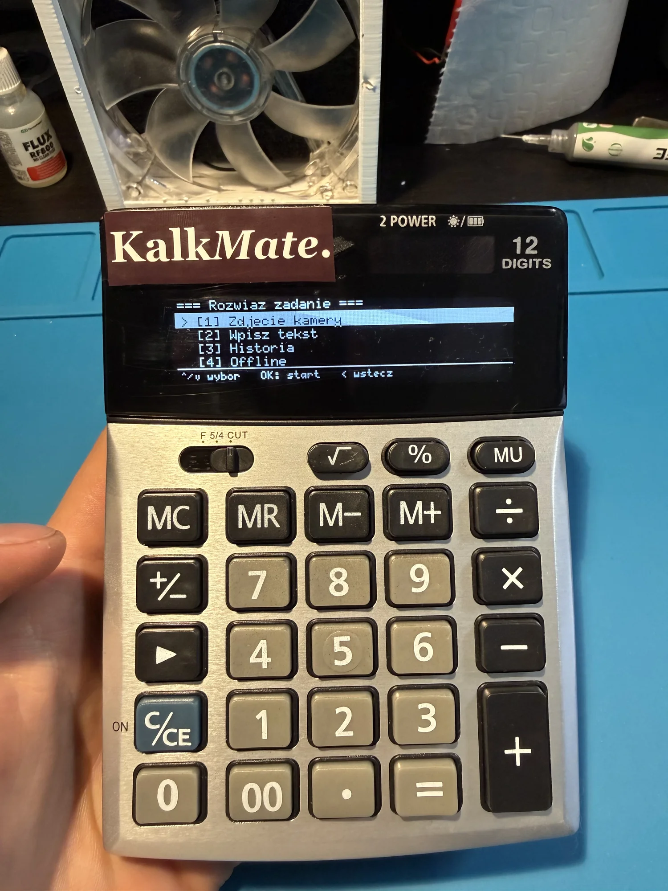
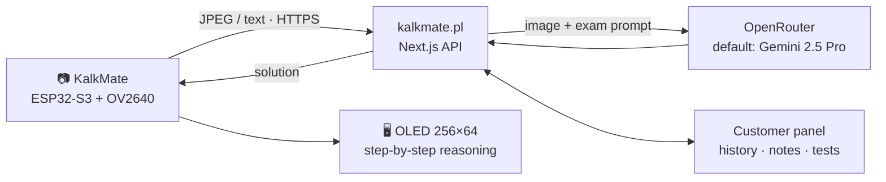
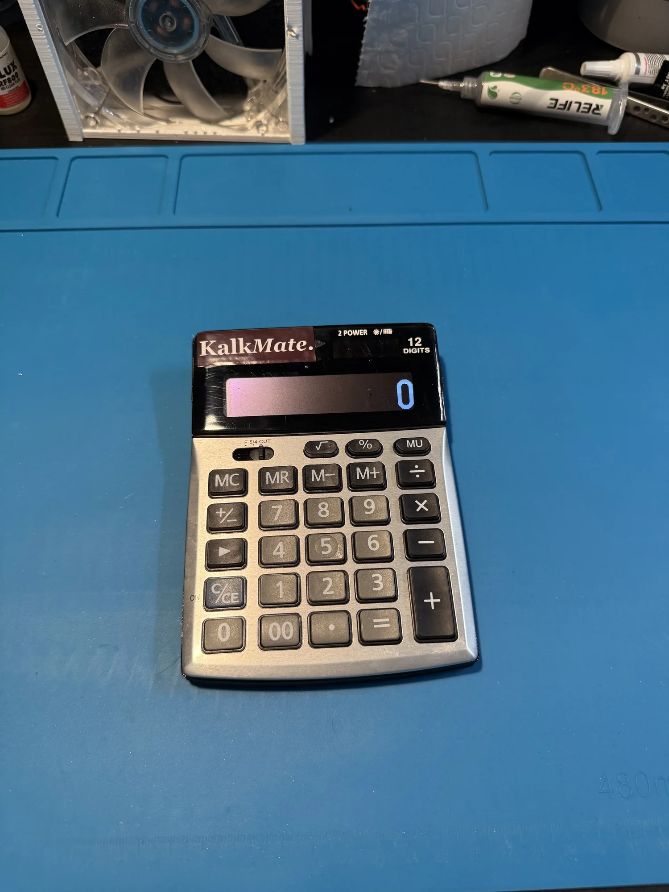
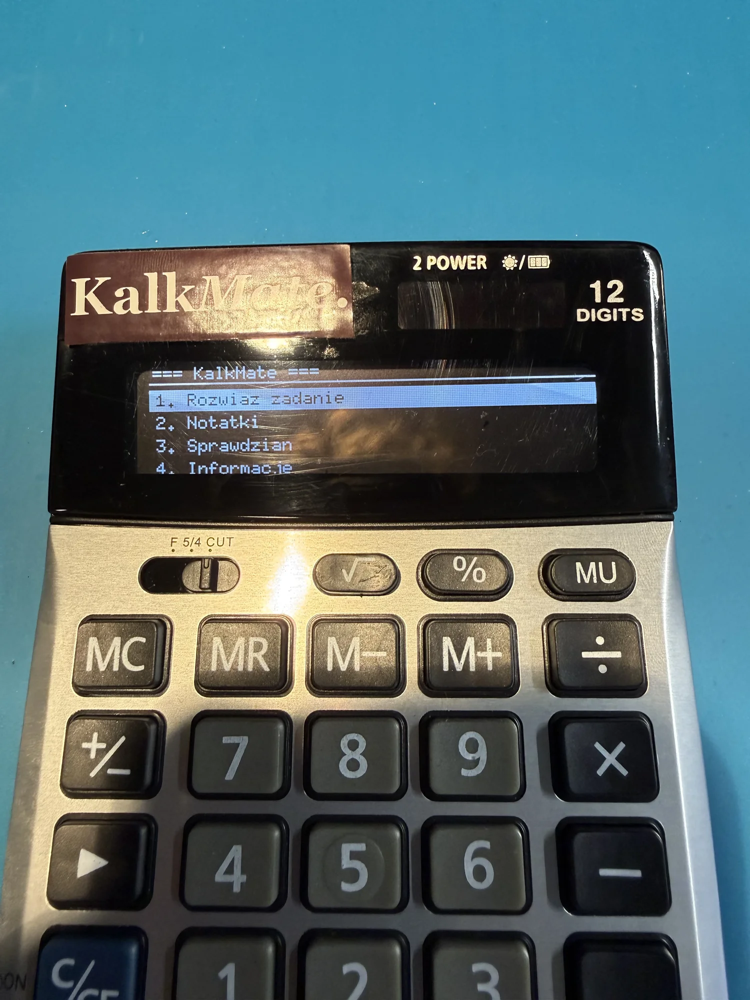
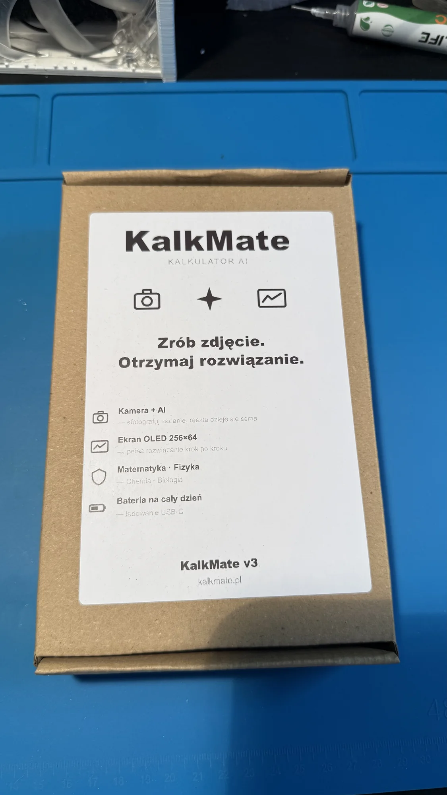
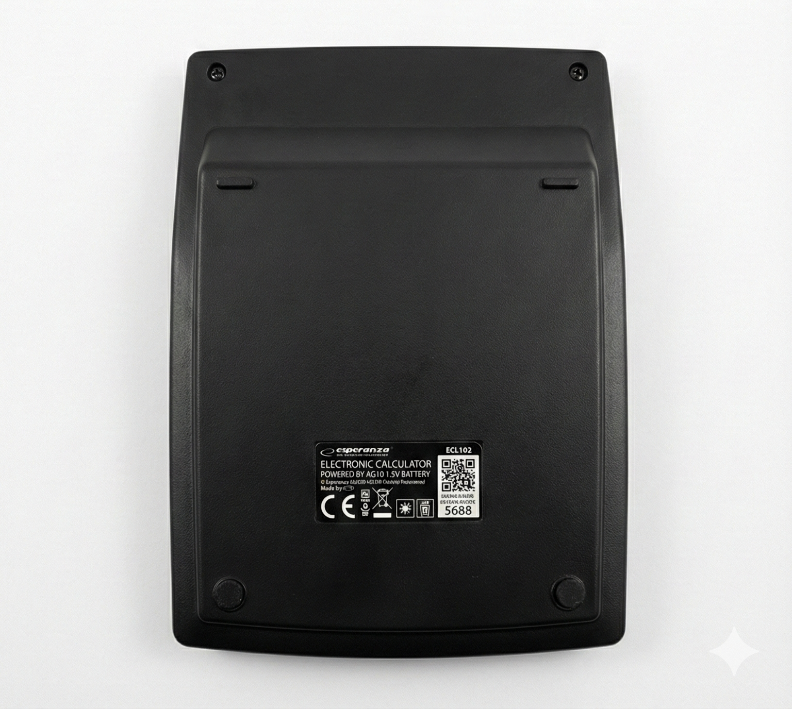

<p align="center">
  
</p>

<h3 align="center">A calculator with a camera and AI for exam prep</h3>

<p align="center">
  Take a photo of a problem — a step-by-step solution appears on the calculator's screen.<br>
  No phone, no browser, no distractions.
</p>

<p align="center">
  <a href="https://kalkmate.pl/en"></a>
  
  
  
  
</p>

<p align="center">
  <a href="README.md">Polski</a> · <b>English</b>
</p>

<p align="center">
  
</p>

---

## At a glance

- **Looks and works like a regular calculator.** AI mode only opens after entering your own code.
- **Photo or text → solution.** Built-in OV2640 camera; the answer, with the full reasoning, is shown on a 256×64 OLED.
- **Maths, physics, chemistry, biology** — the prompt is based on Polish matura (CKE) exam papers and marking rules.
- **Still useful offline** — simple problems (equations, systems, percentages, derivatives) are solved locally; the rest is queued until WiFi is back.
- **Notes and tests** synced from the customer panel on kalkmate.pl.
- **Panic key** — one button and the screen shows a plain calculator.
- **Over-the-air updates** — signed OTA (ECDSA P-256).
- **Device UI in Polish, English and German**; the shop and customer panel come in the same three languages.

> 699 PLN / 169 EUR, first month of AI included, 2-year warranty. Shipping to InPost lockers in Poland and by courier abroad.

## How it works


```mermaid
flowchart LR
    A["📷 KalkMate<br/>ESP32-S3 + OV2640"] -- "JPEG / text · HTTPS" --> B["kalkmate.pl<br/>Next.js API"]
    B -- "image + exam prompt" --> C["OpenRouter<br/>default: Gemini 2.5 Pro"]
    C --> B
    B -- "solution" --> A
    A --> D["🖥️ OLED 256×64<br/>step-by-step reasoning"]
    B <--> E["Customer panel<br/>history · notes · tests"]
```

1. The student picks **Camera photo** (with a live viewfinder and focus bar) or **Type text**.
2. The camera is powered down **before** WiFi starts — its clock interferes with 2.4 GHz.
3. The device sends the problem to its own backend, authenticating with a per-device identity and a license code.
4. The backend calls **OpenRouter**. The default model is Gemini 2.5 Pro; users can pick another model in the panel (Claude, GPT, Grok, DeepSeek, Qwen…). Usage is billed in tokens.
5. The answer (LaTeX turned into readable text) is shown on screen and saved to history.

## Gallery

<table>
<tr>
<td width="50%" align="center">
<br>
<sub>A finished unit — a plain calculator day to day</sub>
</td>
<td width="50%" align="center">
<br>
<sub>AI mode menu: problems, notes, tests</sub>
</td>
</tr>
<tr>
<td width="50%" align="center">
<br>
<sub>KalkMate v3 packaging</sub>
</td>
<td width="50%" align="center">
<br>
<sub>Camera built into the case, no protruding lens</sub>
</td>
</tr>
</table>

Promo video (34 s, Polish voice-over): [`marketing/promo-video/`](marketing/promo-video/).

## Repository

| Directory | Contents |
|---|---|
| [`src/`](src/), [`include/`](include/) | ESP32 firmware (C++ / Arduino, PlatformIO) |
| [`website/`](website/) | Shop, customer panel, admin panel and device API (Next.js) — [README](website/README.md) |
| [`fiscal-agent/`](fiscal-agent/) | Local fiscal agent (Python): prints receipts from the platform on a POSNET fiscal printer over TCP/WiFi — [docs (PL)](docs/fiskalizacja/README.md) |
| [`tools/flasher/`](tools/flasher/) | Production flasher (GUI + CLI): firmware, Flash Encryption, customer code, shipping checklist |
| [`tools/kalkmate-admin-desktop/`](tools/kalkmate-admin-desktop/) | Admin panel as a Windows app (Electron) |
| `tools/i2c_scan`, `keymap_scan`, `greek_font_test` | Board bring-up and display test tools |
| `tools/etykieta-produktowa/` | Product label with compliance marks |
| [`certyfikacja/`](certyfikacja/) | BOM, component certificates, CE declaration of conformity |
| [`docs/`](docs/) | User manuals (PL/EN/DE/FR), complaint forms, security audit, enclosure model |
| [`marketing/`](marketing/) | Promo video and its sources |

## Hardware

| | |
|---|---|
| **MCU** | ESP32-S3-WROOM-1-N16R8 (16 MB flash, 8 MB PSRAM), native USB-C — board v4 |
| **Display** | SSD1322 OLED 256×64, 4-wire SPI, 12 V from an MT3608 boost |
| **Camera** | OV2640, 8-bit parallel + SCCB, 2.8 V / 1.3 V LDOs |
| **Keypad** | 5×5 matrix via an MCP23017 I2C expander (which also switches camera and boost power) |
| **Power** | 3.7 V LiPo, MCP73831 charger, DW01A + FS8205A protection |
| **Compliance** | CE declaration (RED / RoHS / LVD); radio module carries the manufacturer's RED certificate |

Peripherals are switched off when idle: OLED boost (~140 mA), camera (~50 mA), WiFi (~80 mA).
Older v3 boards (ESP32-WROVER-E) are still supported by a separate build environment; their pinout and hardware pitfalls are documented in [`CLAUDE.md`](CLAUDE.md).

## Firmware

```bash
pio run -e esp32s3 -t upload             # board v4 (ESP32-S3)
pio run -e esp32wrover_legacy -t upload  # older v3 boards
pio device monitor -b 115200
```

> Bump `FW_VERSION` in `src/main.cpp` before every release — OTA compares versions.

| Module | Purpose |
|---|---|
| `main.cpp` | startup, main loop, menus |
| `calculator.h` | calculator mode, code-gated entry to AI mode, factory reset (hold C/CE for 5 s) |
| `solve_screen.h`, `camera.h` | live viewfinder, capture, AI request, answer rendering |
| `offline_solver.h`, `offline_queue.h` | offline solving and the outgoing request queue |
| `notes.h`, `tests.h`, `history.h` | notes, tests, history |
| `device_account.h`, `account_screen.h` | account pairing, license status, Device ID + QR code |
| `ota_update.h`, `kalkmate_certs.h` | signed OTA, server TLS certificate verification |
| `remote_session.h` | “Remote help” — screen view for support, only after the user explicitly turns it on |
| `wifi_settings.h`, `wifi_persist.h`, `settings_screen.h` | WiFi, settings, language |
| `battery.h`, `power.h`, `panic.h`, `input.h` | battery and power saving, panic key, keypad |

### Version history

| Version | Highlights |
|---|---|
| 0.1 – 0.6 | calculator + WiFi, OTA, AI mode, notes and tests, device pairing, LaTeX |
| 1.0 | board v4 on ESP32-S3 with native USB-C |
| 1.1 – 1.3 | battery and brownout handling, camera tuning (exposure, white balance, orientation) |
| 1.4 | signed OTA (ECDSA P-256), authenticated firmware downloads |
| 1.5 | live viewfinder with a focus bar |
| 1.7 | offline solving, time sync, PL/EN/DE UI, emergency factory reset |
| 1.8 | better formulas in answers (powers, subscripts, symbols) |
| 1.9 | remote help, customer code provisioned at production; **1.9.6 — current** |

## Website, shop and panels (`website/`)

Next.js 16 (App Router), React 19, Prisma + SQLite, Tailwind CSS 4. Self-hosted on a VPS (Ubuntu + nginx) at [kalkmate.pl](https://kalkmate.pl).

- **Shop (PL / EN / DE):** cart with InPost locker and international shipping (country + region), coupons, personalisation (AI code and name on the label). Payments via **Przelewy24** (BLIK, bank transfer, cards) and **Stripe** (cards, Klarna).
- **Customer panel:** solution history from the device, notes and tests sent to the device, AI model choice, token balance and top-ups, marketing consent.
- **Admin panel** (2FA login; also available as a desktop app and PWA):
  - **orders:** search, tabs, bulk actions (InPost shipping, merged label PDF, packing list, CSV), customs documents;
  - **sales and marketing:** mailbox with AI-drafted replies, newsletter auto-translated to EN/DE, coupons with stats, source and UTM analytics;
  - **devices:** licenses, devices, remote help, AI usage, inventory;
  - **maintenance:** daily database backups.
- **Device API** (`/api/device/*`): registration, status, `solve`, notes, tests, conversations, OTA.
- **Scheduled jobs (cron):** shipment tracking, unpaid-order reminders, cancelling abandoned orders, backups.

Local setup and environment variables: [`website/README.md`](website/README.md).

## Security

- OTA accepts signed images only (ECDSA P-256 + SHA-256). All HTTPS connections verify the server certificate (bundled root CA, no `setInsecure()`).
- Per-device identity instead of one shared key; device endpoints check that the device may access the requested resource (IDOR protection).
- Production units get Flash Encryption in Release mode, burned by the flasher (`PROD_REL`).
- Admin panel: individually revocable sessions + TOTP; rate limits on login and AI endpoints.

Audit and fix log: [`docs/security/`](docs/security/).

## License

The code is public **for viewing only**. All rights reserved — copying, modifying, commercial use and manufacturing devices based on this project require the author's written permission. See [`LICENSE`](LICENSE).

---

<p align="center">
  <b>KAJPA Kacper Popko</b> · <a href="https://kalkmate.pl">kalkmate.pl</a>
</p>
