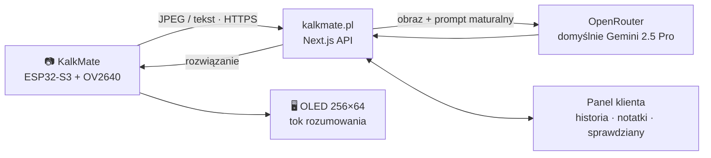

<p align="center">
  
</p>

<h3 align="center">Kalkulator z kamerą i AI do nauki do matury</h3>

<p align="center">
  Zrób zdjęcie zadania — rozwiązanie krok po kroku pojawia się na ekranie kalkulatora.<br>
  Bez telefonu, bez przeglądarki, bez rozpraszaczy.
</p>

<p align="center">
  <a href="https://kalkmate.pl"></a>
  
  
  
  
</p>

<p align="center">
  <b>Polski</b> · <a href="README.en.md">English</a>
</p>

<p align="center">
  
</p>

---

## W skrócie

- **Wygląda i działa jak zwykły kalkulator.** Tryb AI otwiera się dopiero po wpisaniu własnego kodu.
- **Zdjęcie albo tekst → rozwiązanie.** Wbudowana kamera OV2640, odpowiedź z pełnym tokiem rozumowania na OLED 256×64.
- **Matematyka, fizyka, chemia, biologia** — prompt oparty na arkuszach CKE i zasadach oceniania.
- **Bez internetu też coś zrobi** — proste zadania (równania, układy, procenty, pochodne) liczy lokalnie, resztę kolejkuje do wysłania.
- **Notatki i sprawdziany** synchronizowane z panelu klienta na kalkmate.pl.
- **Klawisz paniki** — jeden przycisk i na ekranie jest zwykły kalkulator.
- **Aktualizacje przez WiFi** — podpisane OTA (ECDSA P-256).
- **Interfejs po polsku, angielsku i niemiecku**; sklep i panel w tych samych trzech językach.

> 699 zł / 169 EUR, pierwszy miesiąc AI w zestawie, 2 lata gwarancji. Wysyłka do Paczkomatów InPost w Polsce i kurierem za granicę.

## Jak to działa



1. Uczeń wybiera **Zdjęcie kamery** (z podglądem na żywo i paskiem ostrości) albo **Wpisz tekst**.
2. Kamera wyłącza się **przed** włączeniem WiFi — zegar kamery zakłóca 2,4 GHz.
3. Urządzenie wysyła zadanie do własnego backendu. Uwierzytelnia się tożsamością per urządzenie i kodem licencji.
4. Backend wysyła zadanie przez **OpenRouter**. Domyślny model to Gemini 2.5 Pro; w panelu można wybrać inny (Claude, GPT, Grok, DeepSeek, Qwen…). Koszt jest rozliczany w tokenach.
5. Odpowiedź (z wzorami LaTeX przerobionymi na czytelny tekst) wyświetla się na ekranie i trafia do historii.

## Galeria

<table>
<tr>
<td width="50%" align="center">
<br>
<sub>Gotowy egzemplarz — na co dzień zwykły kalkulator</sub>
</td>
<td width="50%" align="center">
<br>
<sub>Menu trybu AI: zadania, notatki, sprawdziany</sub>
</td>
</tr>
<tr>
<td width="50%" align="center">
<br>
<sub>Opakowanie KalkMate v3</sub>
</td>
<td width="50%" align="center">
<br>
<sub>Kamera zintegrowana z obudową, bez wystającego obiektywu</sub>
</td>
</tr>
</table>

Film promocyjny (34 s, z lektorem): [`marketing/promo-video/`](marketing/promo-video/).

## Repozytorium

| Katalog | Co tam jest |
|---|---|
| [`src/`](src/), [`include/`](include/) | Firmware ESP32 (C++ / Arduino, PlatformIO) |
| [`website/`](website/) | Sklep, panel klienta, panel admina i API urządzeń (Next.js) — [README](website/README.md) |
| [`fiscal-agent/`](fiscal-agent/) | Lokalny agent fiskalny (Python): paragony z platformy na drukarce POSNET po TCP/WiFi — [fiskalizacja](docs/fiskalizacja/README.md) |
| [`tools/flasher/`](tools/flasher/) | Flasher produkcyjny (GUI + CLI): firmware, Flash Encryption, kod klienta, checklista wysyłki |
| [`tools/kalkmate-admin-desktop/`](tools/kalkmate-admin-desktop/) | Panel admina jako aplikacja Windows (Electron) |
| `tools/i2c_scan`, `keymap_scan`, `greek_font_test` | Narzędzia do uruchamiania płytek i testów wyświetlacza |
| `tools/etykieta-produktowa/` | Etykieta produktu ze znakami zgodności |
| [`certyfikacja/`](certyfikacja/) | BOM, certyfikaty komponentów, deklaracja zgodności CE |
| [`docs/`](docs/) | Instrukcje obsługi (PL/EN/DE/FR), formularze reklamacji, audyt bezpieczeństwa, model obudowy |
| [`marketing/`](marketing/) | Film promocyjny i jego źródła |

## Sprzęt

| | |
|---|---|
| **MCU** | ESP32-S3-WROOM-1-N16R8 (16 MB flash, 8 MB PSRAM), natywne USB-C — płytka v4 |
| **Ekran** | OLED SSD1322 256×64, 4-wire SPI, zasilanie 12 V z boosta MT3608 |
| **Kamera** | OV2640, 8-bit parallel + SCCB, LDO 2,8 V / 1,3 V |
| **Klawiatura** | Matryca 5×5 przez ekspander I2C MCP23017 (sterujący też zasilaniem kamery i boosta) |
| **Zasilanie** | LiPo 3,7 V, ładowarka MCP73831, ochrona DW01A + FS8205A |
| **Zgodność** | Deklaracja CE (RED / RoHS / LVD); moduł radiowy z certyfikatem RED producenta |

Peryferia są wyłączane, gdy nie są potrzebne: boost OLED (~140 mA), kamera (~50 mA), WiFi (~80 mA).
Starsze płytki v3 (ESP32-WROVER-E) są nadal obsługiwane osobnym środowiskiem buildu. Ich pinout i pułapki sprzętowe opisuje [`CLAUDE.md`](CLAUDE.md).

## Firmware

```bash
pio run -e esp32s3 -t upload             # płytka v4 (ESP32-S3)
pio run -e esp32wrover_legacy -t upload  # starsze płytki v3
pio device monitor -b 115200
```

> Przed każdym wydaniem podbij `FW_VERSION` w `src/main.cpp` — OTA porównuje wersje.

| Moduł | Zadanie |
|---|---|
| `main.cpp` | start, pętla główna, menu |
| `calculator.h` | tryb kalkulatora, wejście do trybu AI kodem, reset fabryczny (przytrzymanie C/CE 5 s) |
| `solve_screen.h`, `camera.h` | podgląd na żywo, zdjęcie, zapytanie do AI, wyświetlanie odpowiedzi |
| `offline_solver.h`, `offline_queue.h` | rozwiązywanie bez sieci i kolejka zapytań do wysłania |
| `notes.h`, `tests.h`, `history.h` | notatki, sprawdziany, historia |
| `device_account.h`, `account_screen.h` | parowanie z kontem, status licencji, Device ID + kod QR |
| `ota_update.h`, `kalkmate_certs.h` | podpisane OTA, weryfikacja certyfikatu TLS serwera |
| `remote_session.h` | „Zdalna pomoc” — podgląd ekranu dla wsparcia, tylko po świadomym włączeniu przez użytkownika |
| `wifi_settings.h`, `wifi_persist.h`, `settings_screen.h` | WiFi, ustawienia, język |
| `battery.h`, `power.h`, `panic.h`, `input.h` | bateria i oszczędzanie energii, klawisz paniki, klawiatura |

### Historia wersji

| Wersja | Najważniejsze zmiany |
|---|---|
| 0.1 – 0.6 | kalkulator + WiFi, OTA, tryb AI, notatki i sprawdziany, parowanie urządzenia, LaTeX |
| 1.0 | płytka v4 na ESP32-S3 z natywnym USB-C |
| 1.1 – 1.3 | bateria i brownout, strojenie kamery (ekspozycja, balans bieli, orientacja) |
| 1.4 | podpisane OTA (ECDSA P-256), autoryzacja pobierania firmware |
| 1.5 | podgląd na żywo z paskiem ostrości |
| 1.7 | rozwiązywanie offline, synchronizacja czasu, interfejs PL/EN/DE, awaryjny reset fabryczny |
| 1.8 | lepsze wzory w odpowiedziach (potęgi, indeksy, symbole) |
| 1.9 | zdalna pomoc, kod klienta wgrywany przy produkcji; **1.9.6 — aktualna** |

## Strona, sklep i panele (`website/`)

Next.js 16 (App Router), React 19, Prisma + SQLite, Tailwind CSS 4. Działa na własnym VPS (Ubuntu + nginx) pod [kalkmate.pl](https://kalkmate.pl).

- **Sklep (PL / EN / DE):** koszyk z wysyłką do Paczkomatów InPost i za granicę (kraj + region), kupony, personalizacja (kod AI i imię na etykiecie). Płatności przez **Przelewy24** (BLIK, przelew, karty) i **Stripe** (karty, Klarna).
- **Panel klienta:** historia rozwiązań z kalkulatora, notatki i sprawdziany wysyłane na urządzenie, wybór modelu AI, saldo i zakup tokenów, zgoda marketingowa.
- **Panel admina** (logowanie z 2FA, także jako aplikacja desktopowa i PWA):
  - **zamówienia:** wyszukiwanie, zakładki, akcje zbiorcze (nadanie InPost, etykiety w jednym PDF, lista do pakowania, CSV), dokumenty celne;
  - **sprzedaż i marketing:** poczta z odpowiedziami pisanymi przez AI, newsletter tłumaczony na EN/DE, kupony ze statystykami, analityka źródeł i UTM;
  - **urządzenia:** licencje, urządzenia, zdalna pomoc, zużycie AI, magazyn;
  - **utrzymanie:** codzienne kopie bazy.
- **API urządzeń** (`/api/device/*`): rejestracja, status, `solve`, notatki, sprawdziany, rozmowy, OTA.
- **Automaty (cron):** śledzenie przesyłek, przypomnienia o nieopłaconych zamówieniach, anulowanie porzuconych, kopie zapasowe.

Uruchomienie lokalne i zmienne środowiskowe: [`website/README.md`](website/README.md).

## Bezpieczeństwo

- OTA tylko podpisane (ECDSA P-256 + SHA-256). Wszystkie połączenia HTTPS weryfikują certyfikat serwera (wbudowany root CA, bez `setInsecure()`).
- Tożsamość per urządzenie zamiast jednego wspólnego klucza; endpointy urządzeń sprawdzają, czy urządzenie ma dostęp do danego zasobu (ochrona przed IDOR).
- Produkcyjne egzemplarze mają Flash Encryption w trybie Release, wypalany przez flasher (`PROD_REL`).
- Panel admina: sesje odwoływalne pojedynczo + TOTP; limity zapytań na logowaniu i endpointach AI.

Audyt i lista napraw: [`docs/security/`](docs/security/).

## Licencja

Kod jest publiczny **wyłącznie do wglądu**. Wszelkie prawa zastrzeżone — kopiowanie, modyfikacja, użycie komercyjne i produkcja urządzeń na bazie projektu wymagają pisemnej zgody autora. Szczegóły: [`LICENSE`](LICENSE).

---

<p align="center">
  <b>KAJPA Kacper Popko</b> · <a href="https://kalkmate.pl">kalkmate.pl</a>
</p>
